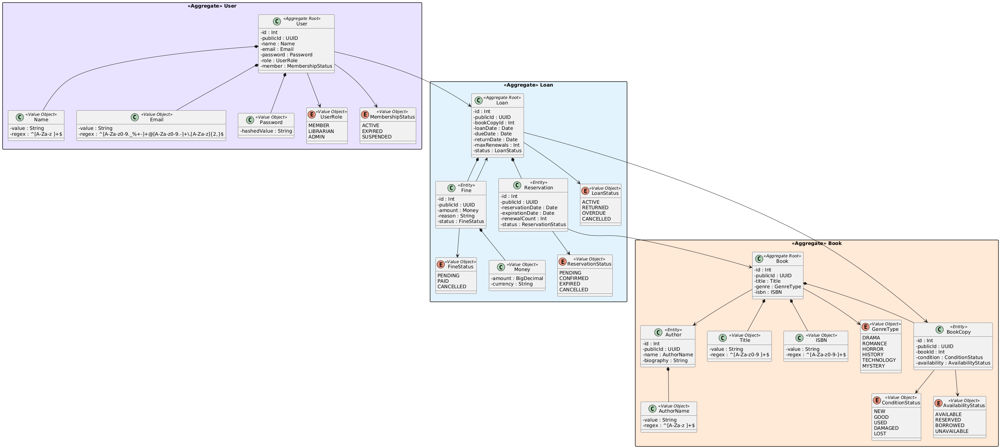

# Library Management System

## Conteúdo

1. [Visão Geral do Sistema](#1-visão-geral-do-sistema)
    - 1.1 [Descrição do Sistema](#11-descrição-do-sistema)
    - 1.2 [Objetivo](#12-objetivo)
    - 1.3 [Atores e Papéis](#13-atores-e-papéis)
2. [Stack Tecnológica](#2-stack-tecnológica)
    - 2.1 [Descrição da Stack](#21-descrição-da-stack)
3. [Arquitetura e Componentes do Sistema](#3-arquitetura-e-componentes-do-sistema)
    - 3.1 [Vista Lógica](#31-vista-lógica)
    - 3.2 [Vista de Implementação](#32-vista-de-implementação)
    - 3.3 [Componentes Principaís](#33-componentes-principaís)
4. [Requesitos](#4-requesitos)
    - 4.1 [Requesitos Funcionais](#41-requesitos-funcionais)
    - 4.2 [Requesitos Não Funcionais](#42-requesitos-não-funcionaís)
5. [Atributos Prioritários](#51-atributos-prioritários)
    - 5.1 [Atributos Prioritários](#51-atributos-prioritários)
    - 5.2 [Quality Attribute Scenarios (ASRs)](#52-quality-attribute-scenarios-asrs)

[Referências](#referências)

---

# Capítulo 1

## Visão Geral do Sistema

### 1.1 Descrição do Sistema

O sistema **Library Management System (LMS)** é uma aplicação Full Stack concebida para digitalizar a operação de uma
livraria através de uma API REST.

O sistema inclui:

* gestão de utilizadores e roles;
* catálogo de livros e autores

---

### 1.2 Objetivo

O principal objetivo do sistema é apoiar a gestão das operações da livraria, incluíndo:

* Gestão de utilizadores e controlo de acesso
* Gestão de Livros, Autores, Reservas, Empréstimos e Multas

---

### 1.3 Atores e Papéis

O sistema define três papéis principaís com diferenes niveís de acesso:

| Role      | Permissões                                                 |
|-----------|------------------------------------------------------------|
| Admin     | Acesso total a todas as funcionalidades do sistema         |
| Librarian | Biblioticário gere os livros, autores, empréstimo e multas | 
| Client    | Visualiza os livros e autores e faz empréstimo             |         

---

# Capítulo 2

## Stack Tecnológica

## 2.1 Descrição da Stack

A tabela seguinte apresenta as tecnologias utilizadas no sistema:

### Backend

| Componente   | Tecnologia                                | Propóstio                        |
|--------------|-------------------------------------------|----------------------------------| 
| Runtime      | [Node.js](https://nodejs.org/en)          | Linguagem principal (JavaScript) |
| Framework    | [Express](https://expressjs.com/)         | Framework web back-end           | 
| Token        | [JWT](https://www.jwt.io/)                | Geração e validação de JWT       | 
| Persistência | [PostgreSQL](https://www.postgresql.org/) | Base de dados relacional         | 

### Frontend

| Componente  | Tecnologia                                    | Propóstio                        |
|-------------|-----------------------------------------------|----------------------------------| 
| Runtime     | [Typescript](https://www.typescriptlang.org/) | Linguagem principal (Typescript) |
| Framework   | [React](https://react.dev/)                   | Framework frontend               | 
| Comunicação | [Axios](https://axios.rest/)                  | Requesições HTTP                 | 
| Styles      | [Tailwinds CSS](https://tailwindcss.com/)     | Framework CSS                    | 
| UI          | [Shadcn UI](https://ui.shadcn.com/)           | Coleção de componentes           | 

---

# Capítulo 3

## Arquitetura e Componentes do Sistema

### 3.1 Vista Lógica

A vista lógica descreve a **estrutura funcional do sistema** e a forma como este se encontra organizado em diferentes
níveis de abstração.

---

#### Nível 1 – Sistema

O **Nível 1** apresenta o sistema **LMS (Library Management System)** como um todo, tratado como uma única unidade
lógica, acessível através de uma API externa.

**Objetivo do nível**:

* Identificar o sistema como um todo
* Definir a sua fronteira externa
* Evidenciar o ponto de entrada principal (API)

*Diagrama da Vista Lógica Nível 1*

#### Nível 2 -

---

#### Nível 3 -

---

#### Nível 4 -

---

### 3.2 Vista de Implementação

A vista de implementação descreve a **organização técnica do sistema** ao contrário da vista lógica, esta vista
explicita **tecnologias**, **mecanismos de comunicação** e **dependências técnicas**, mantendo, no entanto, a separação
clara de responsabilidades definida pela arquitetura.

#### Nível 1 - Sistema

---

#### Nível 2 -

---

#### Nível 3 -

---

#### Nível 4 -

---

### 3.3 Componentes Principaís

#### User

---

#### Book

---

#### Loan

---

*Modelo de domínio DDD - aggregates, entidades e value objects*

---

# Capítulo 4

## Requesitos

### 4.1 Requesitos Funcionais

A tabela seguinte apresenta os requisitos funcionais do sistema, organizados por ator e
com referência aos casos de uso correspondentes.

| ID    | Requesito                                                                                            | Ator(es) | Caso de Uso |
|-------|------------------------------------------------------------------------------------------------------|----------|-------------|
| RF-01 | O sistema deve autenticar utilizadores com `email` e `password` e emitir um JWT com role e expiração | Todos    | UC-         |
| RF-02 | O sistema deve                                                                                       | --       | UC-         |
| RF-03 | O sistema deve                                                                                       | --       | UC-         |
| RF-04 | O sistema deve                                                                                       | --       | UC-         |
| RF-05 | O sistema deve                                                                                       | --       | UC-         |
| RF-06 | O sistema deve                                                                                       | --       | UC-         |
| RF-07 | O sistema deve                                                                                       | --       | UC-         |
| RF-08 | O sistema deve                                                                                       | --       | UC-         |
| RF-09 | O sistema deve                                                                                       | --       | UC-         |
| RF-10 | O sistema deve                                                                                       | --       | UC-         |

---

#### Autenticação e Perfil

| ID | Ator | Descrição |
|----|------|-----------|

---

#### Gestão de Utilizadores

| ID | Ator | Descrição |
|----|------|-----------|

---

#### Gestão de Livros

| ID | Ator | Descrição |
|----|------|-----------|

---

#### Gestão de Autores

| ID | Ator | Descrição |
|----|------|-----------|

---

#### Gestão de Emprestimos

| ID | Ator | Descrição |
|----|------|-----------|

---

#### Gestão de Multas

| ID | Ator | Descrição |
|----|------|-----------|

---

### 4.2 Requesitos Não Funcionaís

#### Functional Suitability

O sistema cumpre os objetivos funcionais para os quais foi concebido, cobrindo as operações necessárias para os três
perfis de utilizador.

| ID     | Sub-característica     | Requesito                                                          | 
|--------|------------------------|--------------------------------------------------------------------|
| RNF-01 | Functional Correctness | A API disponibiliza endpoitns para todas as operações de cada role |
| RNF-02 | Functional Correctness | As regras de negócio são validades na camada de domínio            |
| RNF-03 | Functional Correctness | A API REST com JSON é o formato adequado para o tipo de sistema    |

---

#### Performance Efficiency

| ID | Sub-característica | Requesito | 
|----|--------------------|-----------|

---

#### Compatibility

O sistema expõe uma API REST que deve ser consumível por qualquer cliente que respeite
os contratos definidos independentemente da linguagem ou plataforma do cliente.

| ID | Sub-característica | Requesito | 
|----|--------------------|-----------|

---

#### Interaction Capability

| ID | Sub-característica | Requesito | 
|----|--------------------|-----------|

---

#### Reliability

| ID | Sub-característica | Requesito | 
|----|--------------------|-----------|

---

#### Security

| ID | Sub-característica | Requesito | 
|----|--------------------|-----------|

---

#### Maintainability

A manutenibilidade do sistema é assegurada na medida em que suporta a evolução segura
do código, as modificações não devem introduzir vulnerabilidades nem comprometer os
controlos de segurança existentes.

| ID | Sub-característica | Requesito | 
|----|--------------------|-----------|

---

#### Flexibility

| ID | Sub-característica | Requesito | 
|----|--------------------|-----------|

---

#### Safety

**Não aplicável**. O *LMS* é uma aplicação de gestão operacional sem impacto direto em vidas humanas, saúde, propriedade
física ou ambiente.

---

## Capítulo 5

## Atributos de Qualidade e ASRs

### 5.1 Atributos Prioritários

---

### 5.2 Quality Attribute Scenarios (ASRs)

---

## Referências

[Attribute-Driven Design (ADD) – Software Engineering Institute (SEI)](https://www.sei.cmu.edu/documents/775/2006_005_001_14795.pdf)

Método utilizado como base para a decomposição arquitetural, identificação de Architecturally Significant Requirements (
ASRs) e tomada sistemática de decisões arquiteturais orientadas por atributos de qualidade.

---

[Software Architecture in Practice (Bass, Clements, Kazman)](https://ptgmedia.pearsoncmg.com/images/9780321815736/samplepages/0321815734.pdf)

Referência fundamental em arquitetura de software, utilizada para fundamentar conceitos como estilos arquiteturais,
trade-offs, avaliação arquitetural e atributos de qualidade.

---

[ISO/IEC 25010](https://iso25000.com/en/iso-25000-standards/iso-25010)

Norma internacional que define e categoriza os critérios para avaliar a qualidade de produtos de software e sistemas
computacionais

---

[Command Query Responsibility Segregation (CQRS) – Martin Fowler](https://martinfowler.com/bliki/CQRS.html)

Padrão arquitetural adotado para separação de responsabilidades de leitura e escrita, contribuindo para melhoria de
performance, escalabilidade e flexibilidade na gestão de dados.